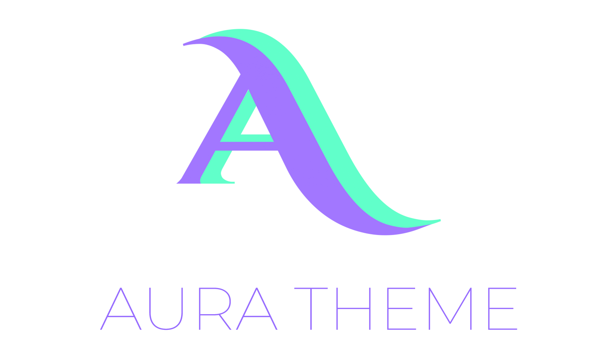

# dotfiles
My type of Dotfiles cocktail :cocktail: using [stow](https://www.gnu.org/software/stow/).

The config uses a consistent colorscheme called **AURA THEME** developed by
Github: [daltonmenezes/aura-theme](https://github.com/daltonmenezes/aura-theme/)

  

## Applications
### File manager
- **lf** - a terminal file manager written in Go with a heavy inspiration from ranger file manager.

* **Dependencies**:
    - [ctpv](https://github.com/NikitaIvanovV/ctpv)
    - [bat](https://github.com/sharkdp/bat)
    - [fzf](https://github.com/junegunn/fzf)
    - [ripgrep](https://github.com/BurntSushi/ripgrep)
    - [fdfind](https://github.com/sharkdp/fd)

LF - Coloring mixer website: [lscolors](https://geoff.greer.fm/lscolors/)

### Terminal Emulator
- **Alacritty** - A fast, cross-platform, OpenGL terminal emulator

Required Font: [Fira-Code](https://fonts.google.com/specimen/Fira+Code)
